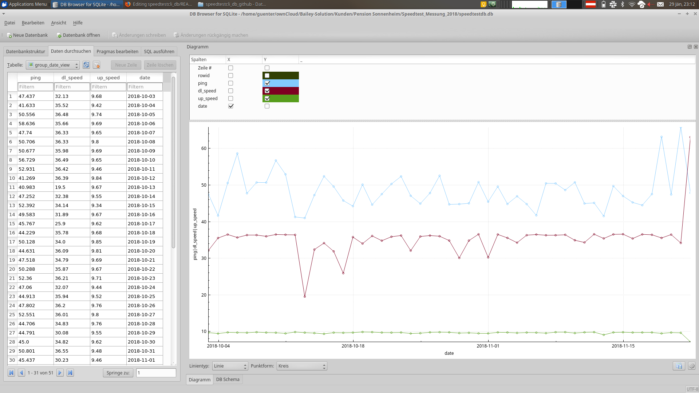

# Speedtestcli-db

Dieses Script verwendet das Python Programm [**speedtest-cli**](https://github.com/sivel/speedtest-cli) und schreibt die Resultate nach und nach in eine SQLite Datenbank.
Danach kann man die Resultate z.b.: mit mit dem [**DB Browser for SQLite**](https://sqlitebrowser.org) öffnen und auch darin ein Diagramm erstellen.

## Benötigte Pakete

* Python 3.4,3.5 oder 3.6
* PIP (für die weiteren installationen der benötigten Pakete)

## Installation

Mit pip install -r requirements.txt installiert man die restlichen Pakete.
<pre> user@NB:#$ pip install -r requirements.txt</pre>

## Verwendung

Die Optionen kann man im Script mit **--help** anzeigen lassen.
<pre>
user@NB:#$ python speedtestcli-db.py --help
Usage: Speedtestcli-db v0.1.3 options

Options:
  -h, --help   show this help message and exit
  --run-test   run Speedtest and store result into DB
  --create-db  rename old database if exists and create new one 
</pre>

### Speedtest Messung

Wenn man *speedtestcli-db.py* mit der option *--run-test* aufruft, erzeugt es falls nicht vorhanden eine SQLite Datenbank,
und startet mit der Messung.
Dabei wird das Resultat der Messung erst zum schluss angezeigt, somit kann es ein wenig dauern bis man das Resultat sieht (für die Anleitung dauerte es ca. 23 Sekunden).

<pre>
user@NB:#$ python speedtestcli-db.py --run-test
Speedtest Completed
=========================
        Results          
-------------------------
Ping =  45.08 ms
Download =  18.80 Mbit/s
Upload =  14.43 Mbit/s
=========================
</pre>

Wenn man jetzt nochmal mit dem gleichen Befehl aufruft, wird das ergebnis in die bereits bestehende Datenbank geschrieben.

## Cronjob erstellen

Falls man eine Messung über längeren Zeitraum braucht, empfiehlt es sich einen Cronjob mit dem Aufruf vom *speedtestcli-db* zu verwenden.
Dabei sollte man das Programm aus dem verzeichnis aufrufen.

In diesem Beispiel wird das Script alle 15 Minuten im Ordner unter */home/user/speedtestcli-db* aufgerufen.
Ausgaben werden direkt in ein Tempverzeichnis gelegt (somit bekommt man nicht jedesmal eine E-Mail, falls ein Script etwas ausgibt.

<pre>*/15 * * * * cd /home/user/speedtestcli-db && /usr/bin/python3 speedtestcli-db.py --run-test</pre>

## Auswertung

Für die Auswertung in SQLite wurden 3 Views hinterlegt, die zeigt die Daten Gruppiert mit den Höchst- und Tiefstwerten an.
Das kann man einfach mit einem SQLite Manager / Browser ansehen, oder auch mit einem Programm die Daten Abgreifen.

Bei diesem Beispiel können wir die X und Y Achse als Linien Diagramm darstellen

## Speedtestcli-db in einem Docker Container

kommt noch!

